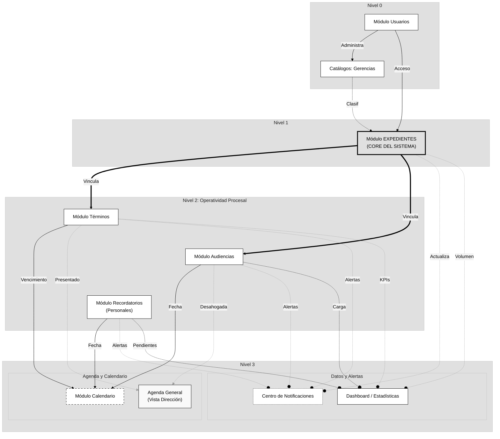
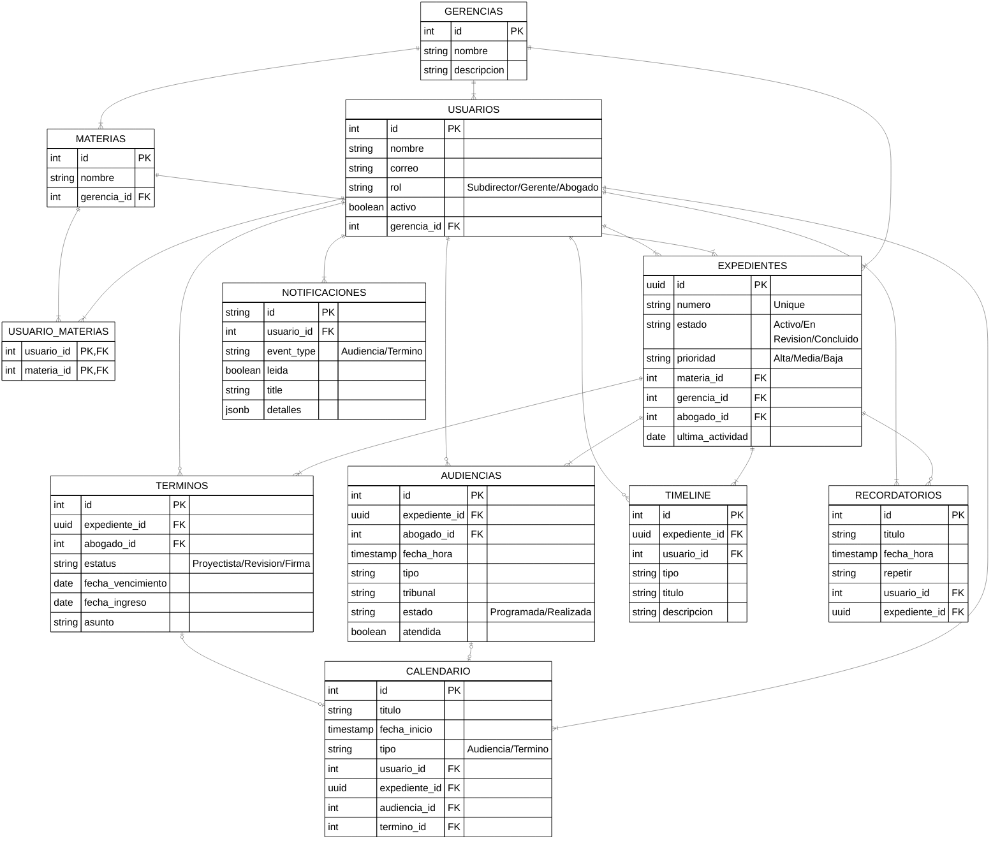

```mermaid
%%{init: { 
  'theme': 'base', 
  'flowchart': { 
    'curve': 'basis', 
    'nodeSpacing': 50, 
    'rankSpacing': 80 
  },
  'themeVariables': { 
    'primaryColor': '#ffffff', 
    'primaryTextColor': '#000000', 
    'primaryBorderColor': '#000000', 
    'lineColor': '#000000', 
    'secondaryColor': '#f4f4f4', 
    'tertiaryColor': '#e0e0e0' 
  } 
}}%% 

graph TD 
    %% --- CAPA DE CONFIGURACIÓN --- 
    %% SOLUCIÓN: Se añadió ";" al final de la definición
    subgraph Config ["Nivel 0"];
        direction LR
        Usuarios[Módulo Usuarios] 
        Catalogos[Catálogos: Gerencias] 
    end 

    %% --- CAPA CORE --- 
    subgraph Core ["Nivel 1"];
        Expedientes["Módulo EXPEDIENTES<br/>(CORE DEL SISTEMA)"] 
    end 

    %% --- CAPA OPERATIVA --- 
    subgraph Operacion ["Nivel 2: Operatividad Procesal"];
        %% Forzamos orden horizontal con enlaces invisibles
        Terminos[Módulo Términos] ~~~ Audiencias[Módulo Audiencias] ~~~ Recordatorios["Módulo Recordatorios<br/>(Personales)"]
    end 

    %% --- CAPA DE VISUALIZACIÓN Y CONTROL --- 
    subgraph Visualizacion ["Nivel 3"];
        direction LR
        %% Sub-bloque Visualización
        subgraph Vis ["Agenda y Calendario"];
            direction TB
            Agenda["Agenda General<br/>(Vista Dirección)"] 
            Calendario[Módulo Calendario] 
        end
        
        %% Sub-bloque Datos
        subgraph Data ["Datos y Alertas"];
            direction TB
            Notificaciones[Centro de Notificaciones] 
            Dashboard[Dashboard / Estadísticas] 
        end
    end 

    %% --- RELACIONES DE CONFIGURACIÓN --- 
    Usuarios -->|Administra| Catalogos 
    Usuarios -->|Acceso| Expedientes 
    Catalogos -.->|Clasif| Expedientes 

    %% --- FLUJO DEL CORE --- 
    Expedientes ==>|Vincula| Terminos 
    Expedientes ==>|Vincula| Audiencias 

    %% --- SINCRONIZACIÓN (Lado Izquierdo) --- 
    Terminos -->|Vencimiento| Calendario 
    Audiencias -->|Fecha| Calendario 
    Recordatorios -->|Fecha| Calendario 

    %% --- AGENDA (Lado Izquierdo) --- 
    Terminos -.->|Presentado| Agenda 
    Audiencias -.->|Desahogada| Agenda 

    %% --- NOTIFICACIONES Y DASHBOARD (Lado Derecho) --- 
    Terminos -.-o|Alertas| Notificaciones 
    Audiencias -.-o|Alertas| Notificaciones 
    Recordatorios -.-o|Alertas| Notificaciones 
    Expedientes -.-o|Actualiza| Notificaciones 

    Expedientes -.-o|Volumen| Dashboard 
    Terminos -.-o|KPIs| Dashboard 
    Audiencias -.-o|Carga| Dashboard 
    Recordatorios -.-o|Pendientes| Dashboard 

    %% --- ESTILOS VISUALES --- 
    style Expedientes fill:#e0e0e0,stroke:#000000,stroke-width:3px 
    style Calendario stroke-dasharray: 5 5 
    style Agenda fill:#f9f9f9,stroke:#000000 
    style Notificaciones stroke:#333,stroke-dasharray: 2 2
    
    %% --- ESTILO DE ENLACES PARA REDUCIR RUIDO VISUAL ---
    linkStyle 10,11,12,13,14,15,16,17 stroke:#999,stroke-width:1px,stroke-dasharray: 2 2;
```

```mermaid
%%{init: {
  'theme': 'base', 
  'themeVariables': { 
    'fontSize': '40px', 
    'fontFamily': 'Arial',
    'primaryColor': '#ffffff',
    'primaryTextColor': '#000000',
    'primaryBorderColor': '#000000',
    'lineColor': '#000000',
    'secondaryColor': '#f4f4f4',
    'tertiaryColor': '#ffffff'
  }
}}%%
erDiagram
    %% --- RELACIONES JERÁRQUICAS ---
    %% SOLUCIÓN: Agregamos : "" al final para que no de error pero no muestre texto
    GERENCIAS ||--|{ USUARIOS : ""
    GERENCIAS ||--|{ MATERIAS : ""
    USUARIOS ||--|{ USUARIO_MATERIAS : ""
    MATERIAS ||--|{ USUARIO_MATERIAS : ""
    
    %% --- RELACIONES EXPEDIENTE ---
    GERENCIAS ||--|{ EXPEDIENTES : ""
    MATERIAS ||--|{ EXPEDIENTES : ""
    USUARIOS ||--|{ EXPEDIENTES : ""
    
    %% --- OPERATIVIDAD ---
    EXPEDIENTES ||--|{ AUDIENCIAS : ""
    EXPEDIENTES ||--|{ TERMINOS : ""
    EXPEDIENTES ||--|{ TIMELINE : ""
    EXPEDIENTES ||--o{ RECORDATORIOS : ""
    
    %% --- ROLES SECUNDARIOS USUARIOS ---
    USUARIOS ||--o{ AUDIENCIAS : ""
    USUARIOS ||--o{ TERMINOS : ""
    USUARIOS ||--o{ TIMELINE : ""
    
    %% --- MÓDULOS DE SOPORTE ---
    USUARIOS ||--|{ NOTIFICACIONES : ""
    USUARIOS ||--|{ CALENDARIO : ""
    USUARIOS ||--|{ RECORDATORIOS : ""

    %% --- SINCRONIZACIÓN CALENDARIO ---
    AUDIENCIAS |o--o| CALENDARIO : ""
    TERMINOS |o--o| CALENDARIO : ""

    %% === DEFINICIÓN DETALLADA DE TABLAS ===

    USUARIOS {
        int id PK
        string nombre
        string correo
        string rol "Subdirector/Gerente/Abogado"
        boolean activo
        int gerencia_id FK
    }

    GERENCIAS {
        int id PK
        string nombre
        string descripcion
    }

    MATERIAS {
        int id PK
        string nombre
        int gerencia_id FK
    }

    USUARIO_MATERIAS {
        int usuario_id PK,FK
        int materia_id PK,FK
    }

    EXPEDIENTES {
        uuid id PK
        string numero "Unique"
        string estado "Activo/En Revision/Concluido"
        string prioridad "Alta/Media/Baja"
        int materia_id FK
        int gerencia_id FK
        int abogado_id FK
        date ultima_actividad
    }

    AUDIENCIAS {
        int id PK
        uuid expediente_id FK
        int abogado_id FK
        timestamp fecha_hora
        string tipo
        string tribunal
        string estado "Programada/Realizada"
        boolean atendida
    }

    TERMINOS {
        int id PK
        uuid expediente_id FK
        int abogado_id FK
        string estatus "Proyectista/Revision/Firma"
        date fecha_vencimiento
        date fecha_ingreso
        string asunto
    }

    TIMELINE {
        int id PK
        uuid expediente_id FK
        int usuario_id FK
        string tipo
        string titulo
        string descripcion
    }

    NOTIFICACIONES {
        string id PK
        int usuario_id FK
        string event_type "Audiencia/Termino"
        boolean leida
        string title
        jsonb detalles
    }

    CALENDARIO {
        int id PK
        string titulo
        timestamp fecha_inicio
        string tipo "Audiencia/Termino"
        int usuario_id FK
        uuid expediente_id FK
        int audiencia_id FK
        int termino_id FK
    }

    RECORDATORIOS {
        int id PK
        string titulo
        timestamp fecha_hora
        string repetir
        int usuario_id FK
        uuid expediente_id FK
    }
```

```mermaid
%%{init: {
  'theme': 'base',
  'themeVariables': {
    'primaryColor': '#fff',
    'lineColor': '#555',
    'fontSize': '14px',
    'fontFamily': 'arial',
    'clusterBkg': '#f4f7f6',
    'clusterBorder': '#cfd8dc'
  },
  'flowchart': {
     'curve': 'basis',
     'rankSpacing': 50,
     'nodeSpacing': 20
  }
}}%%

graph TD

    %% --- DEFINICIÓN DE ESTILOS ---
    classDef api fill:#e1f5fe,stroke:#0277bd,stroke-width:2px,rx:5,ry:5;
    classDef logic fill:#fff9c4,stroke:#fbc02d,stroke-width:2px,rx:5,ry:5;
    classDef db fill:#e8f5e9,stroke:#2e7d32,stroke-width:2px,rx:0,ry:0;
    classDef ext fill:#f3e5f5,stroke:#7b1fa2,stroke-width:2px,stroke-dasharray: 5 5;

    %% ==========================================
    %% CAPA 1: CONTROLADORES (ENTRY POINTS)
    %% ==========================================
    subgraph API_LAYER [ ]
        direction LR
        
        %% Módulo Admin
        C_Auth[Auth Controller]:::api
        C_User[Usuario Controller]:::api
        C_Cat[Catálogo Controller]:::api
        
        %% Módulo Core (Negocio)
        C_Exp[Expediente Controller]:::api
        C_Aud[Audiencia Controller]:::api
        C_Term[Termino Controller]:::api
        C_Rec[Recordatorio Controller]:::api
        
        %% Módulo Analytics
        C_Dash[Dashboard Controller]:::api
        C_Cal[Calendario Controller]:::api
    end

    %% ==========================================
    %% CAPA 2: SERVICIOS (LÓGICA DE NEGOCIO)
    %% ==========================================
    subgraph SERVICE_LAYER [ ]
        direction LR
        
        %% Lógica Admin
        S_Auth[Auth Service]:::logic
        S_Notif[Notificación Service]:::logic
        
        %% Lógica Core
        S_Exp[Expediente Service]:::logic
        S_Aud[Audiencia Service]:::logic
        S_Term[Termino Service]:::logic
        S_Rec[Recordatorio Service]:::logic
        
        %% Servicios de Apoyo (Cross-Cutting)
        S_Stor[Storage Service]:::logic
        S_Dash[Dashboard Service]:::logic
    end

    %% ==========================================
    %% CAPA 3: DATOS (REPOSITORIOS)
    %% ==========================================
    subgraph DATA_LAYER [-]
        direction LR
        
        %% Datos Maestros
        R_User[(Usuario Repo)]:::db
        R_Ger[(Gerencia Repo)]:::db
        
        %% Datos Transaccionales
        R_Exp[(Expediente Repo)]:::db
        R_Time[(Timeline Repo)]:::db
        R_Aud[(Audiencia Repo)]:::db
        R_Term[(Termino Repo)]:::db
        R_Rec[(Recordatorio Repo)]:::db
        
        %% Datos de Soporte
        R_Cal[(Calendario Repo)]:::db
        R_File[(Archivo Repo)]:::db
    end

    %% ==========================================
    %% CONEXIONES (ARQUITECTURA)
    %% ==========================================

    %% -- Flujo 1: Autenticación y Admin --
    C_Auth --> S_Auth
    C_User --> S_Auth
    S_Auth --> R_User
    C_Cat --> R_Ger
    
    %% -- Flujo 2: Expedientes (Core) --
    C_Exp --> S_Exp
    S_Exp --> R_Exp
    S_Exp --> R_Time
    
    %% -- Flujo 3: Audiencias y Términos (Agenda) --
    C_Aud --> S_Aud
    C_Term --> S_Term
    
    S_Aud --> R_Aud
    S_Aud --> R_Cal
    S_Term --> R_Term
    S_Term --> R_Cal
    
    C_Cal --> R_Cal

    %% -- Flujo 3.1: Recordatorios (NUEVO) --
    C_Rec --> S_Rec
    S_Rec --> R_Rec
    S_Rec --> R_Cal
    S_Rec -.-> S_Notif

    %% -- Flujo 4: Gestión de Archivos (Compartido) --
    S_Aud -.-> S_Stor
    S_Term -.-> S_Stor
    S_Stor --> R_File

    %% -- Flujo 5: Dashboard (Analytics) --
    C_Dash --> S_Dash
    S_Dash -- Lee Métricas --> R_Exp
    S_Dash -- Lee Métricas --> R_Aud
    S_Dash -- Lee Métricas --> R_Term

    %% -- Flujo 6: Notificaciones --
    S_Exp -.-> S_Notif
    S_Aud -.-> S_Notif
```