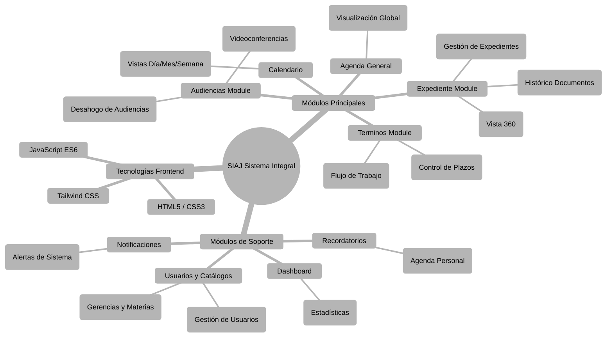
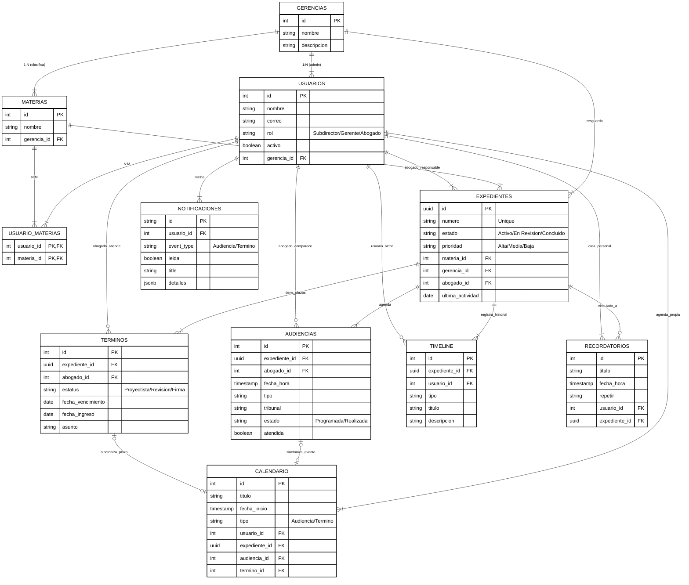

```mermaid
%%{init: { 
  'theme': 'base', 
  'themeVariables': { 
    'textColor': '#000000',
    'fontFamily': 'Arial',
    'fontSize': '14px',
    'lineColor': '#000000',
    
    'primaryColor': '#f5f5f5',
    'primaryTextColor': '#000000',
    'primaryBorderColor': '#000000',
    
    'secondaryColor': '#f5f5f5',
    'secondaryTextColor': '#000000',
    'secondaryBorderColor': '#000000',
    
    'tertiaryColor': '#f5f5f5',
    'tertiaryTextColor': '#000000',
    'tertiaryBorderColor': '#000000',

    'quaternaryColor': '#f5f5f5',
    'quaternaryTextColor': '#000000',
    'quaternaryBorderColor': '#000000'
  } 
}}%%
mindmap
  root((SIAJ Sistema Integral))
    Módulos Principales
      Expediente Module
        ::icon(fa fa-folder)
        (Gestión de Expedientes)
        (Vista 360)
        (Histórico Documentos)
      Terminos Module
        ::icon(fa fa-clock)
        (Control de Plazos)
        (Flujo de Trabajo)
      Audiencias Module
        ::icon(fa fa-gavel)
        (Desahogo de Audiencias)
        (Videoconferencias)
      Agenda General
        (Visualización Global)
      Calendario
        (Vistas Día/Mes/Semana)
    Módulos de Soporte
      Dashboard
        ::icon(fa fa-chart-line)
        (Estadísticas)
      Notificaciones
        ::icon(fa fa-bell)
        (Alertas de Sistema)
      Recordatorios
        (Agenda Personal)
      Usuarios y Catálogos
        (Gerencias y Materias)
        (Gestión de Usuarios)
    Tecnologías Frontend
      ::icon(fa fa-code)
      HTML5 / CSS3
      JavaScript ES6
      Tailwind CSS
```

hola

```mermaid
%%{init: {
  'theme': 'base', 
  'themeVariables': { 
    'fontSize': '20px', 
    'fontFamily': 'Arial',
    'primaryColor': '#ffffff',
    'primaryTextColor': '#000000',
    'primaryBorderColor': '#000000',
    'lineColor': '#000000',
    'secondaryColor': '#f4f4f4',
    'tertiaryColor': '#ffffff'
  }
}}%%
erDiagram
    %% --- RELACIONES JERÁRQUICAS ---
    GERENCIAS ||--|{ USUARIOS : "1:N (admin)"
    GERENCIAS ||--|{ MATERIAS : "1:N (clasifica)"
    USUARIOS ||--|{ USUARIO_MATERIAS : "N:M"
    MATERIAS ||--|{ USUARIO_MATERIAS : "N:M"
    
    %% --- RELACIONES EXPEDIENTE ---
    GERENCIAS ||--|{ EXPEDIENTES : "resguarda"
    MATERIAS ||--|{ EXPEDIENTES : "tipifica"
    USUARIOS ||--|{ EXPEDIENTES : "abogado_responsable"
    
    %% --- OPERATIVIDAD ---
    EXPEDIENTES ||--|{ AUDIENCIAS : "agenda"
    EXPEDIENTES ||--|{ TERMINOS : "tiene_plazos"
    EXPEDIENTES ||--|{ TIMELINE : "registra_historial"
    EXPEDIENTES ||--o{ RECORDATORIOS : "vinculado_a"
    
    %% --- ROLES SECUNDARIOS USUARIOS ---
    USUARIOS ||--o{ AUDIENCIAS : "abogado_comparece"
    USUARIOS ||--o{ TERMINOS : "abogado_atiende"
    USUARIOS ||--o{ TIMELINE : "usuario_actor"
    
    %% --- MÓDULOS DE SOPORTE ---
    USUARIOS ||--|{ NOTIFICACIONES : "recibe"
    USUARIOS ||--|{ CALENDARIO : "agenda_propia"
    USUARIOS ||--|{ RECORDATORIOS : "crea_personal"

    %% --- SINCRONIZACIÓN CALENDARIO ---
    AUDIENCIAS |o--o| CALENDARIO : "sincroniza_evento"
    TERMINOS |o--o| CALENDARIO : "sincroniza_plazo"

    %% === DEFINICIÓN DETALLADA DE TABLAS ===

    USUARIOS {
        int id PK
        string nombre
        string correo
        string rol "Subdirector/Gerente/Abogado"
        boolean activo
        int gerencia_id FK
    }

    GERENCIAS {
        int id PK
        string nombre
        string descripcion
    }

    MATERIAS {
        int id PK
        string nombre
        int gerencia_id FK
    }

    USUARIO_MATERIAS {
        int usuario_id PK,FK
        int materia_id PK,FK
    }

    EXPEDIENTES {
        uuid id PK
        string numero "Unique"
        string estado "Activo/En Revision/Concluido"
        string prioridad "Alta/Media/Baja"
        int materia_id FK
        int gerencia_id FK
        int abogado_id FK
        date ultima_actividad
    }

    AUDIENCIAS {
        int id PK
        uuid expediente_id FK
        int abogado_id FK
        timestamp fecha_hora
        string tipo
        string tribunal
        string estado "Programada/Realizada"
        boolean atendida
    }

    TERMINOS {
        int id PK
        uuid expediente_id FK
        int abogado_id FK
        string estatus "Proyectista/Revision/Firma"
        date fecha_vencimiento
        date fecha_ingreso
        string asunto
    }

    TIMELINE {
        int id PK
        uuid expediente_id FK
        int usuario_id FK
        string tipo
        string titulo
        string descripcion
    }

    NOTIFICACIONES {
        string id PK
        int usuario_id FK
        string event_type "Audiencia/Termino"
        boolean leida
        string title
        jsonb detalles
    }

    CALENDARIO {
        int id PK
        string titulo
        timestamp fecha_inicio
        string tipo "Audiencia/Termino"
        int usuario_id FK
        uuid expediente_id FK
        int audiencia_id FK
        int termino_id FK
    }

    RECORDATORIOS {
        int id PK
        string titulo
        timestamp fecha_hora
        string repetir
        int usuario_id FK
        uuid expediente_id FK
    }
```
