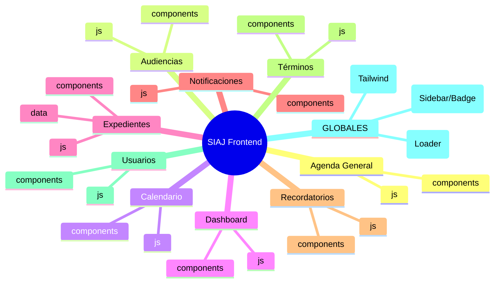

# Arquitectura del Frontend - Módulo Audiencias

## Estructura del Proyecto

```
audiencias/
├── index.html                  # Página principal del módulo
├── css/
│   └── styles.css              # Estilos específicos del módulo
├── js/
│   └── audiencias.js           # Lógica JavaScript del módulo
└── components/
    └── modals.html             # Modales para crear/editar audiencias
```

---

## Tabla de Componentes

| Carpeta | Archivo | Funcionalidad |
|---------|---------|---------------|
| **/** | `index.html` | Punto de entrada principal del módulo. Contiene la estructura HTML con tabla de audiencias, filtros de búsqueda (tipo, gerencia, materia, prioridad), búsqueda en tiempo real, botón de exportar y orquestación de carga de componentes mediante JavaScript módulo. |
| **css/** | `styles.css` | Define estilos CSS personalizados para el módulo: estilos de semáforo de audiencias, badges de estado (Pendiente/Con Acta/Concluida), efectos visuales y adaptaciones específicas que no se logran con Tailwind CSS. |
| **js/** | `audiencias.js` | **Lógica de negocio principal**. Maneja el ciclo de vida de audiencias: CRUD completo, flujo de 3 estados (Pendiente → Con Acta → Concluida), gestión de actas y documentos (subir/descargar/eliminar), sistema de comentarios por audiencia, filtros avanzados, exportación de datos, validación de formularios y vinculación con expedientes. |
| **components/** | `modals.html` | Contiene todos los modales del módulo: modal de nuevo/editar audiencia, modal de comentarios, modal de finalizar audiencia y modales globales del sistema. |

---

## Flujo de Datos

```
index.html (Vista)
    ↓
loader.js (Carga componentes)
    ↓
components/ (Modales)
    ↓
audiencias.js (Lógica de Negocio)
    ↓
localStorage/API (Persistencia)
```

---

## Estados de Audiencia

| Estado | Descripción | Acciones Permitidas |
|--------|-------------|---------------------|
| **Pendiente** | Audiencia sin acta adjunta | Subir acta |
| **Con Acta** | Audiencia con documento, pendiente de conclusión | Ver acta, Desahogar, Quitar acta |
| **Concluida** | Audiencia finalizada con observaciones | Ver acta |

---

## Tecnologías Utilizadas

- **Tailwind CSS** - Framework CSS para diseño responsivo
- **Font Awesome 6.4** - Iconografía
- **Google Fonts** - Tipografía: Montserrat (títulos) y Noto Sans (cuerpo)
- **LocalStorage** - Persistencia de datos local

---

## Patrones de Diseño

- **Carga Asíncrona**: Componentes inyectados dinámicamente
- **Patrón Funcional Modular**: Funciones expuestas globalmente para interacción DOM
- **Gestión de Estados**: Workflow de 3 estados definido por `estadosAudiencia`
- **Semáforo Visual**: Indicadores de proximidad de fecha (Rojo/Amarillo/Verde)
- **Sistema de Comentarios**: Historial de comentarios con usuario y fecha

