# 🏛️ Sistema Jurídico GOB.MX V3 - Base de Datos Unificada

## 📋 Descripción del Proyecto

Este proyecto es un sistema integral de gestión jurídica desarrollado para instituciones gubernamentales mexicanas, siguiendo las directrices de diseño GOB.MX V3. El sistema modular permite gestionar usuarios, expedientes, audiencias, términos, calendario, notificaciones y otros aspectos del proceso jurídico.

Esta propuesta presenta la estructura de base de datos relacional (PostgreSQL) diseñada para solucionar las limitaciones de escalabilidad actuales (localStorage), incorporando lógica de negocio específica para la asignación de abogados, gestión de permisos, notificaciones jerárquicas y auditoría.

## 🗄️ Arquitectura de Base de Datos

### Tecnologías Recomendadas

- **Base de Datos**: PostgreSQL (robustez, integridad referencial y soporte JSONB).
- **ORM**: Prisma / TypeORM.
- **Migración**: Scripts SQL para transición desde localStorage.

### Diagrama de Relaciones (ERD Actualizado)

Nota: Se eliminó el módulo de "Actividades" y se ajustó la relación de Materias según las nuevas reglas de negocio (1:N estricto con Gerencias).

```mermaid
graph TD
    User[Usuarios] -->|1:N| Ger[Gerencias]
    Mat[Materias] -->|N:1| Ger[Gerencias]
    Exp[Expedientes] -->|N:1| User
    Exp -->|N:1| Ger
    Exp -->|N:1| Mat
    Aud[Audiencias] -->|N:1| Exp
    Term[Términos] -->|N:1| Exp
    Time[Timeline] -->|N:1| Exp
    Noti[Notificaciones] -->|N:1| User
    Cal[Calendario] -->|N:1| User
    Cal -.->|Opcional| Aud
    Cal -.->|Opcional| Term
```



## 🔗 Matriz de Relaciones del Sistema (Detallada)

A continuación se detalla la integridad referencial y la lógica de negocio aplicada a cada relación.

### 1. Estructura Organizacional (Usuarios y Gerencias)

| Tabla Origen | Llave Foránea (FK) | Tabla Destino | Tipo | Integridad (On Delete) | Lógica de Negocio / Razón |
|--------------|-------------------|---------------|------|-------------------------|----------------------------|
| usuarios | gerencia_id | gerencias | N:1 | RESTRICT | Un usuario pertenece administrativamente a una Gerencia. No se puede borrar una gerencia si tiene usuarios activos. |
| materias | gerencia_id | gerencias | N:1 | CASCADE | Regla estricta: Una materia (ej. Penal) es gestionada exclusivamente por una Gerencia. Si la gerencia desaparece, sus materias también. |
| usuario_materias | usuario_id | usuarios | N:M | CASCADE | Tabla pivote. Define el expertise del abogado. Si se borra el usuario, se borra su asignación de especialidad. |
| usuario_materias | materia_id | materias | N:M | CASCADE | Define qué materias domina el abogado. |

### 2. Gestión de Expedientes (Core)

| Tabla Origen | Llave Foránea (FK) | Tabla Destino | Tipo | Integridad (On Delete) | Lógica de Negocio / Razón |
|--------------|-------------------|---------------|------|-------------------------|----------------------------|
| expedientes | gerencia_id | gerencias | N:1 | RESTRICT | El expediente es activo de la Gerencia. Permite filtrar "Todos los casos de la Gerencia X". |
| expedientes | materia_id | materias | N:1 | RESTRICT | Clasifica el expediente. Es vital para reportes estadísticos. |
| expedientes | abogado_id | usuarios | N:1 | RESTRICT | Asigna el responsable principal del caso. No se puede borrar al usuario si tiene expedientes a su cargo (primero reasignar). |
| expediente_timeline | expediente_id | expedientes | N:1 | CASCADE | Historial de auditoría. Pertenece intrínsecamente al expediente. |
| expediente_timeline | usuario_id | usuarios | N:1 | SET NULL | Indica quién hizo el cambio. Si el usuario se borra, se mantiene el registro histórico pero sin link al perfil (preserva la auditoría). |

### 3. Seguimiento Procesal (Audiencias y Términos)

| Tabla Origen | Llave Foránea (FK) | Tabla Destino | Tipo | Integridad (On Delete) | Lógica de Negocio / Razón |
|--------------|-------------------|---------------|------|-------------------------|----------------------------|
| audiencias | expediente_id | expedientes | N:1 | CASCADE | Si el expediente se elimina (depuración), sus audiencias futuras o pasadas también se eliminan. |
| audiencias | abogado_id | usuarios | N:1 | RESTRICT | Lógica Flexible: El abogado que comparece puede ser distinto al del expediente. Permite reasignación de audiencia sin cambiar el dueño del caso. |
| terminos | expediente_id | expedientes | N:1 | CASCADE | Los plazos legales están atados a la existencia del expediente. |
| terminos | abogado_id | usuarios | N:1 | SET NULL | Responsable de cumplir el término. Si el abogado sale, el término queda "huérfano" (NULL) para ser reasignado inmediatamente. |

### 4. Agenda y Notificaciones (Alertas)

| Tabla Origen | Llave Foránea (FK) | Tabla Destino | Tipo | Integridad (On Delete) | Lógica de Negocio / Razón |
|--------------|-------------------|---------------|------|-------------------------|----------------------------|
| notificaciones | usuario_id | usuarios | N:1 | CASCADE | Las alertas son privadas del usuario. Si el usuario no existe, sus notificaciones no tienen sentido. |
| eventos_calendario | usuario_id | usuarios | N:1 | CASCADE | Agenda personal del abogado. |
| eventos_calendario | expediente_id | expedientes | N:1 | SET NULL | Vincula el evento al expediente para acceso rápido. Si se borra el expediente, la cita queda en agenda como referencia de tiempo ocupado. |
| eventos_calendario | audiencia_id | audiencias | 1:1 | CASCADE | Sincronización: Si se borra la audiencia oficial, debe desaparecer del calendario visual. |
| eventos_calendario | termino_id | terminos | 1:1 | CASCADE | Sincronización: Si el término se cumple/borra, debe desaparecer o actualizarse en el calendario. |
| recordatorios | usuario_id | usuarios | N:1 | CASCADE | Recordatorios personales (notas adhesivas digitales). |

## 📊 Esquema de Tablas (DDL)

### 1. usuarios

Se incluyen todos los roles jerárquicos definidos.

```sql
CREATE TABLE usuarios (
    id SERIAL PRIMARY KEY,
    nombre VARCHAR(255) NOT NULL,
    correo VARCHAR(255) UNIQUE NOT NULL,
    contraseña_hash VARCHAR(255) NOT NULL,
    rol VARCHAR(50) NOT NULL CHECK (rol IN ('SUBDIRECTOR', 'GERENTE', 'ABOGADO', 'JEFEDEDEPTO', 'DIRECCION')),
    activo BOOLEAN DEFAULT TRUE,
    gerencia_id INTEGER REFERENCES gerencias(id),
    fecha_creacion TIMESTAMP DEFAULT CURRENT_TIMESTAMP,
    fecha_actualizacion TIMESTAMP DEFAULT CURRENT_TIMESTAMP
);
```

### 2. gerencias

```sql
CREATE TABLE gerencias (
    id SERIAL PRIMARY KEY,
    nombre VARCHAR(255) NOT NULL UNIQUE,
    descripcion TEXT,
    fecha_creacion TIMESTAMP DEFAULT CURRENT_TIMESTAMP
);
```

### 3. materias

Cambio importante: Se eliminó la tabla pivote gerencia_materias. Se agrega gerencia_id aquí para cumplir la regla: "Una materia solo puede pertenecer a una gerencia".

```sql
CREATE TABLE materias (
    id SERIAL PRIMARY KEY,
    nombre VARCHAR(100) NOT NULL UNIQUE,
    descripcion TEXT,
    gerencia_id INTEGER REFERENCES gerencias(id) ON DELETE CASCADE, -- Relación 1:N estricta
    fecha_creacion TIMESTAMP DEFAULT CURRENT_TIMESTAMP
);
```

### 4. usuario_materias

Relación muchos a muchos entre usuarios y materias (Expertise del abogado).

```sql
CREATE TABLE usuario_materias (
    usuario_id INTEGER REFERENCES usuarios(id) ON DELETE CASCADE,
    materia_id INTEGER REFERENCES materias(id) ON DELETE CASCADE,
    PRIMARY KEY (usuario_id, materia_id)
);
```

### 5. expedientes

```sql
CREATE TABLE expedientes (
    id UUID PRIMARY KEY DEFAULT gen_random_uuid(),
    numero VARCHAR(100) UNIQUE NOT NULL,
    descripcion TEXT,
    materia_id INTEGER REFERENCES materias(id), -- Relacionado por ID, no string
    prioridad VARCHAR(20) DEFAULT 'Media' CHECK (prioridad IN ('Baja', 'Media', 'Alta', 'Urgente')),
    estado VARCHAR(50) DEFAULT 'Activo' CHECK (estado IN ('Activo', 'En Revisión', 'Concluido', 'Archivado')),
    abogado_id INTEGER REFERENCES usuarios(id), -- Asignación principal
    gerencia_id INTEGER REFERENCES gerencias(id),
    ultima_actividad DATE,
    actualizaciones INTEGER DEFAULT 0,
    fecha_creacion TIMESTAMP DEFAULT CURRENT_TIMESTAMP,
    fecha_actualizacion TIMESTAMP DEFAULT CURRENT_TIMESTAMP,
    fecha_conclusion TIMESTAMP NULL
);
```

### 6. audiencias

Se ha priorizado el uso de IDs (abogado_id) sobre nombres en texto para permitir la lógica de reasignación y privilegios compartidos.

```sql
CREATE TABLE audiencias (
    id SERIAL PRIMARY KEY,
    expediente_id UUID REFERENCES expedientes(id) ON DELETE CASCADE,
    tipo VARCHAR(100) NOT NULL,
    fecha_hora TIMESTAMP NOT NULL, -- Unificado fecha y hora
    tribunal VARCHAR(255),
    actor VARCHAR(255),
    atendida BOOLEAN DEFAULT FALSE,
    acta_documento VARCHAR(255),
    abogado_id INTEGER REFERENCES usuarios(id), -- Abogado asignado a comparecer
    prioridad VARCHAR(20) DEFAULT 'Media',
    observaciones TEXT,
    comentarios JSONB,
    estado VARCHAR(50) DEFAULT 'PROGRAMADA' CHECK (estado IN ('PROGRAMADA', 'REALIZADA', 'CANCELADA', 'POSPUESTA')),
    fecha_creacion TIMESTAMP DEFAULT CURRENT_TIMESTAMP,
    fecha_actualizacion TIMESTAMP DEFAULT CURRENT_TIMESTAMP
);
```

### 7. terminos

```sql
CREATE TABLE terminos (
    id SERIAL PRIMARY KEY,
    expediente_id UUID REFERENCES expedientes(id) ON DELETE CASCADE,
    abogado_id INTEGER REFERENCES usuarios(id),
    asunto VARCHAR(255),
    estatus VARCHAR(50) DEFAULT 'Proyectista' CHECK (estatus IN ('Proyectista', 'Revisión', 'Gerencia', 'Dirección', 'Liberado', 'Presentado', 'Concluido')),
    fecha_ingreso DATE,
    fecha_vencimiento DATE,
    acuse_documento VARCHAR(255),
    prioridad VARCHAR(20) DEFAULT 'Media',
    actuacion VARCHAR(255),
    comentarios JSONB,
    fecha_creacion TIMESTAMP DEFAULT CURRENT_TIMESTAMP
);
```

### 8. expediente_timeline

```sql
CREATE TABLE expediente_timeline (
    id SERIAL PRIMARY KEY,
    expediente_id UUID REFERENCES expedientes(id) ON DELETE CASCADE,
    tipo VARCHAR(50) NOT NULL,
    titulo VARCHAR(255) NOT NULL,
    descripcion TEXT,
    usuario_id INTEGER REFERENCES usuarios(id),
    fecha TIMESTAMP DEFAULT CURRENT_TIMESTAMP,
    metadata JSONB
);
```

### 9. notificaciones

Diseñada para manejar la lógica donde Dirección recibe alertas de nuevas audiencias/términos.

```sql
CREATE TABLE notificaciones (
    id VARCHAR(50) PRIMARY KEY, -- ID generado por sistema/frontend
    usuario_id INTEGER REFERENCES usuarios(id) ON DELETE CASCADE,
    event_type VARCHAR(50) NOT NULL CHECK (event_type IN ('audiencia', 'termino', 'recordatorio', 'sistema')),
    title VARCHAR(255) NOT NULL,
    mensaje TEXT,
    expediente_ref VARCHAR(100),
    leida BOOLEAN DEFAULT FALSE,
    detalles JSONB, -- Para ligar a ID de audiencia/termino
    fecha_creacion TIMESTAMP DEFAULT CURRENT_TIMESTAMP
);
```

### 10. eventos_calendario

Actualizado para incluir relación con términos y audiencias.

```sql
CREATE TABLE eventos_calendario (
    id SERIAL PRIMARY KEY,
    titulo VARCHAR(255) NOT NULL,
    fecha_inicio TIMESTAMP NOT NULL,
    fecha_fin TIMESTAMP NULL,
    tipo VARCHAR(50) CHECK (tipo IN ('AUDIENCIA', 'RECORDATORIO', 'REUNION', 'PLAZO', 'TERMINO')),
    usuario_id INTEGER REFERENCES usuarios(id),
    expediente_id UUID REFERENCES expedientes(id) ON DELETE SET NULL,
    audiencia_id INTEGER REFERENCES audiencias(id) ON DELETE SET NULL,
    termino_id INTEGER REFERENCES terminos(id) ON DELETE SET NULL, -- Relación agregada
    todo_el_dia BOOLEAN DEFAULT FALSE,
    color VARCHAR(7) DEFAULT '#3788d8',
    fecha_creacion TIMESTAMP DEFAULT CURRENT_TIMESTAMP
);
```

### 11. recordatorios

```sql
CREATE TABLE recordatorios (
    id SERIAL PRIMARY KEY,
    titulo VARCHAR(255) NOT NULL,
    fecha_hora TIMESTAMP NOT NULL,
    repetir VARCHAR(50) DEFAULT 'NUNCA',
    usuario_id INTEGER REFERENCES usuarios(id) ON DELETE CASCADE,
    expediente_id UUID REFERENCES expedientes(id) ON DELETE SET NULL,
    activo BOOLEAN DEFAULT TRUE
);
```

## 📝 Consultas SQL Clave

### 1. Dashboard de Dirección (Carga de Trabajo)

Permite visualizar qué abogados tienen más audiencias programadas y términos por vencer.

```sql
SELECT 
    u.nombre as abogado,
    g.nombre as gerencia,
    COUNT(DISTINCT a.id) as audiencias_pendientes,
    COUNT(DISTINCT t.id) as terminos_activos
FROM usuarios u
LEFT JOIN gerencias g ON u.gerencia_id = g.id
LEFT JOIN audiencias a ON a.abogado_id = u.id AND a.estado = 'PROGRAMADA'
LEFT JOIN terminos t ON t.abogado_id = u.id AND t.estatus != 'Concluido'
WHERE u.activo = TRUE
GROUP BY u.id, g.nombre
ORDER BY audiencias_pendientes DESC;
```

### 2. Notificaciones para Dirección (Regla de Negocio)

Obtiene las alertas no leídas específicas para roles directivos.

```sql
SELECT n.* FROM notificaciones n
JOIN usuarios u ON n.usuario_id = u.id
WHERE u.rol = 'DIRECCION' 
AND n.leida = FALSE
AND n.event_type IN ('audiencia', 'termino');
```

## 🚀 Plan de Migración

- **Limpieza de Datos (LocalStorage)**: Asegurar que los campos de texto libre (como nombres de abogados en audiencias) se normalicen para coincidir con los usuarios registrados.
- **Schema Setup**: Ejecutar el DDL de PostgreSQL presentado arriba.
- **Migración de Catálogos**: Cargar Gerencias y Materias (respetando la nueva regla 1:1 entre Materia-Gerencia).
- **Migración de Usuarios**: Crear usuarios y asignar sus gerencia_id.
- **Migración Transaccional**: Mover Expedientes -> Audiencias -> Términos.
- **Validación**: Verificar que las notificaciones de prueba lleguen al rol DIRECCION.

## 📅 Estado: Consolidado (Enero 2025)
## 🔒 Seguridad: Hash bcrypt, Roles (RBAC), Logs de auditoría en Timeline.
